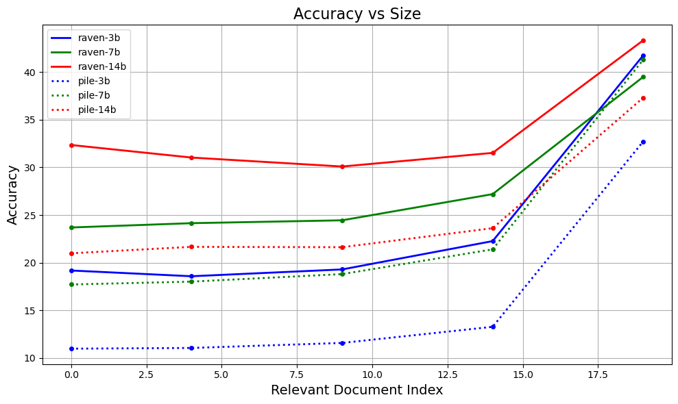

# nlp-nebula
## A repository containing code for **DS207: Introduction to NLP** (IISc, Bangalore) course project. 
###### Repository name has nothing to do with the project topic.

Original Paper = "Lost in the Middle: How Language Models Use Long Contexts".
Read paper [here](https://arxiv.org/pdf/2305.13048.pdf).

### Objective -
To find out whether LLMs can really utilize their full context length.

### Experiment/Task Descriptions -
1. **Key-Value Retrieval :**
Given $k$ (unique) key-value pairs and a (one) key, find its corresponding value, where $k \in \{75, 140, 300\}$. The position of the query key is varied and its effect on the accuracy is noted.
2. **Multi-Document Question-Answer :**
Given $k$ documents (text excerpts) and a question, give the answer, where $k \in \{10, 20, 30\}$. Moreover, exactly one of the k documents is relevant for answering the question and remaining are distractors. The position of the relevant document is varied and its effect on the accuracy is noted.
###### These are just high level overview of the experiments. A detailed description will be added latter.

### Experimental Results of Gemini -
We have used Gemini pro 1.0. For more details, here is the [Gemini technical report](https://storage.googleapis.com/deepmind-media/gemini/gemini_1_report.pdf)
###### Note : You may see "Gemini pro" in the code and test results, which is at the time of testing is an alias for Gemini pro 1.0

1. **Key-Value Retrieval Task for 75 Keys:**
   
| Correct Key at location -> | 0 | 24 | 49 | 74 |
| :---: | :---: | :---: | :---: | :---: |
| W/O QAC | 100% | 99.8% | 100% | 100% |
| W/ QAC | 100% | 100% | 100% | 100% |

2. **Key-Value Retrieval Task for 140 Keys:**
   
| Correct Key at location -> | 0 | 34 | 69 | 104 | 139 |
| :---: | :---: | :---: | :---: | :---: | :---: |
| W/O QAC | 100% | 99.4% | 100% | 100% | 100% |
| W/ QAC | 99.8% | 100% | 100% | 100% | 100% |

3. **Key-Value Retrieval Task for 140 Keys:**
   
| Correct Key at location -> | 0 | 49 | 99 | 149 | 199 | 249 | 299 |
| :---: | :---: | :---: | :---: | :---: | :---: | :---: | :---: |
| W/O QAC | 95.4% | 90% | 95.6% | 87% | 98.2% | 98.6% | 100% |
| W/ QAC | 97.2% | 100% | 100% | 100% | 100% | 99.8% | 100% |

4. **Question-Answer Task:**

| Relevant Document Location -> | 0 | 4 | 9 | 14 | 19 | 24 | 29 |
| :---: | :---: | :---: | :---: | :---: | :---: | :---: | :---: |
| QA Task Closedbook | 43.61% | - | - | - | - | - | - |
| QA Task Oracle w/o QAC | 71.56% | - | - | - | - | - | - |
| QA Task Oracle w/ QAC | 78.30% |  - | - | - | - | - | - |
| QA Task on 10 Doc w/o QAC | 62.63% | 57.21% | 65.98% | - | - | - | - |
| QA Task on 10 Doc w/ QAC | 67.38% | 64.97% | 69.22% | - | - | - | - |
| QA Task on 20 Doc w/o QAC | 58.56% | 53.18% | 54.80% | 55.55% | 64.44% | - | - |
| QA Task on 20 Doc w/ QAC | 63.27% | 59.96% | 62.33% | 62.22% | 67.34% | - | - |
| QA Task on 30 Doc w/o QAC | 57.92% | 44.63% | 45.64% | 48.73% | 51.33% | 50.99% | 63.76% |
| QA Task on 30 Doc w/ QAC | 63.69% | 54.08% | 54.38% | 56.98% | 59.47% | 60.15% | 66.96% |

### Experimental Results of RWKV v4 -
We have used RWKV v4 instruction tuned model with 14B parameters for all the testing, for details refer [Hugging Face Model Card].(https://huggingface.co/BlinkDL/rwkv-4-raven)
###### Note : RWKV v5 and v6 is available but with less than equal to 7B parameters only.

1. **Key-Value Retrieval Task:**
   RWKV Models cann't answer this task.
2. **Question-Answer Task:**

| Relevant Document Location -> | 0 | 4 | 9 | 14 | 19 | 24 | 29 |
| :---: | :---: | :---: | :---: | :---: | :---: | :---: | :---: |
| QA Task Closedbook | 30.77% | - | - | - | - | - | - |
| QA Task Oracle w/o QAC | 80.56% | - | - | - | - | - | - |
| QA Task Oracle w/ QAC | 76.19% |  - | - | - | - | - | - |
| QA Task on 10 Doc w/o QAC | 38.45% | 34.95% | 43.84% | - | - | - | - |
| QA Task on 10 Doc w/ QAC | 38.34% | 33.59% | 40.94% | - | - | - | - |
| QA Task on 20 Doc w/o QAC | 32.35% | 31.03% | 30.09% | 31.52% | 43.35% | - | - |
| QA Task on 20 Doc w/ QAC | 32.91% | 30.88% | 30.13% | 30.80% | 39.77% | - | - |
| QA Task on 30 Doc w/o QAC | 30.24% | 29.45% | 29.03% | 29.03% | 29.67% | 30.92% | 46.21% |
| QA Task on 30 Doc w/ QAC | 29.64% | 28.88% | 28.17% | 27.68% | 28.02% | 29.26% | 43.50% |

### Effect of Model Size on Accuracy -
###### Note : We have used RWKV v4, raven implies the model is instruct fine tuned and pile implies the model is base model.

1. **Question-Answer Task with 30 Documents:**

| Relevant Document Location -> | 0 | 4 | 9 | 14 | 19 |
| :---: | :---: | :---: | :---: | :---: | :---: |
| Raven 3B | 19.17% | 18.56% | 19.28% | 22.25% | 41.77% |
| Raven 7B | 23.69% | 24.14% | 24.44% | 27.19% | 39.51% |
| Raven 14B | 32.35% | 31.03% | 30.09% | 31.52% | 43.35% |
| Pile 3B | 10.96% | 11.03% | 11.56% | 13.25% | 32.73% |
| Pile 7B | 17.70% | 18.00% | 18.79% | 21.39% | 41.31% |
| Pile 14B | 20.97% | 21.65% | 21.61% | 23.61% | 37.32% |

### Contributors -
1. [Anjali Chauhan](https://github.com/anjc24)
2. [Shishir Roy](https://github.com/yoR-rihsihS)
3. [Yash Patel](https://github.com/yash8071)
###### Check out commits to see exactly who contributed to what!
